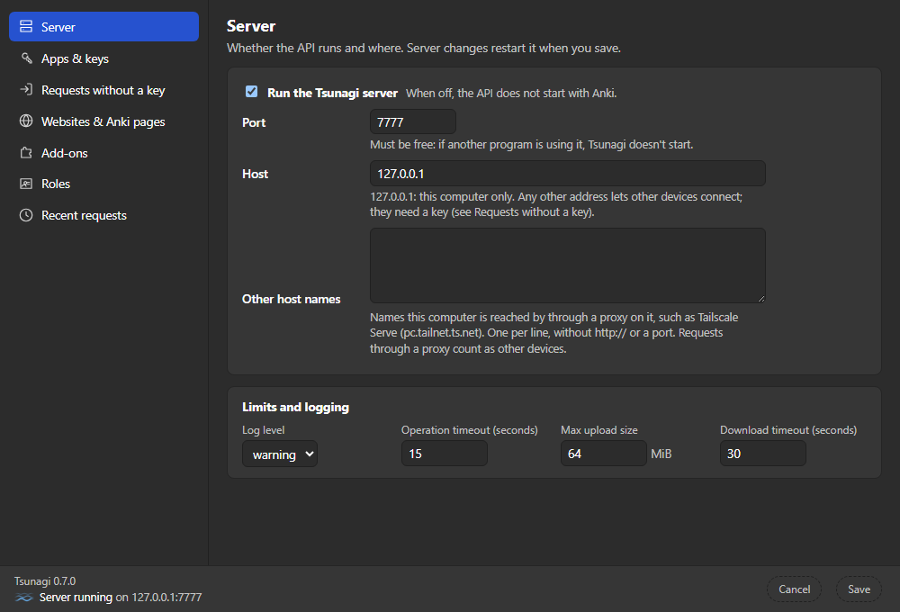
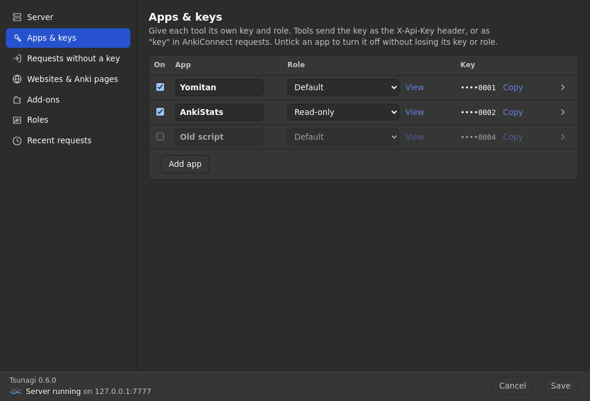
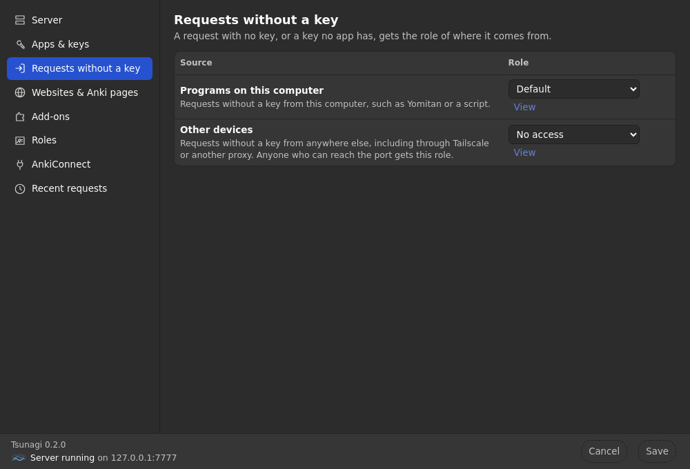
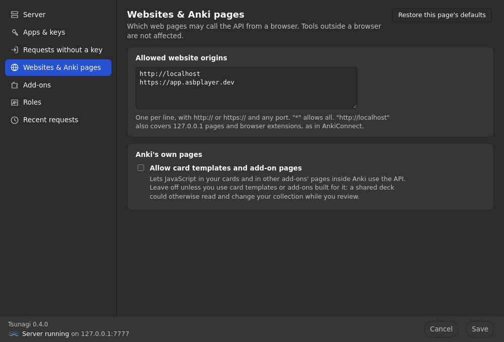
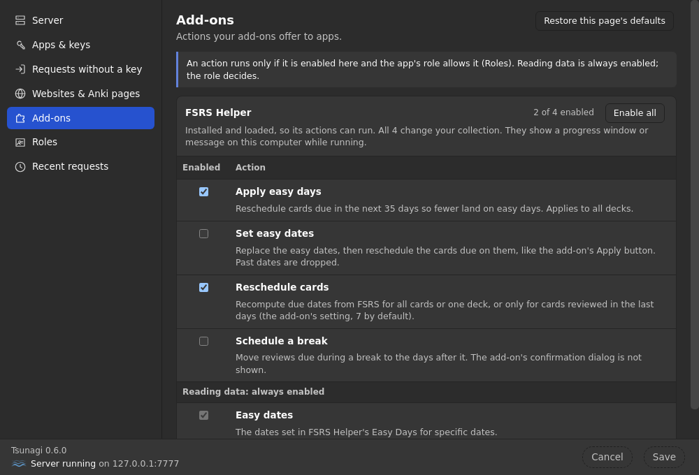
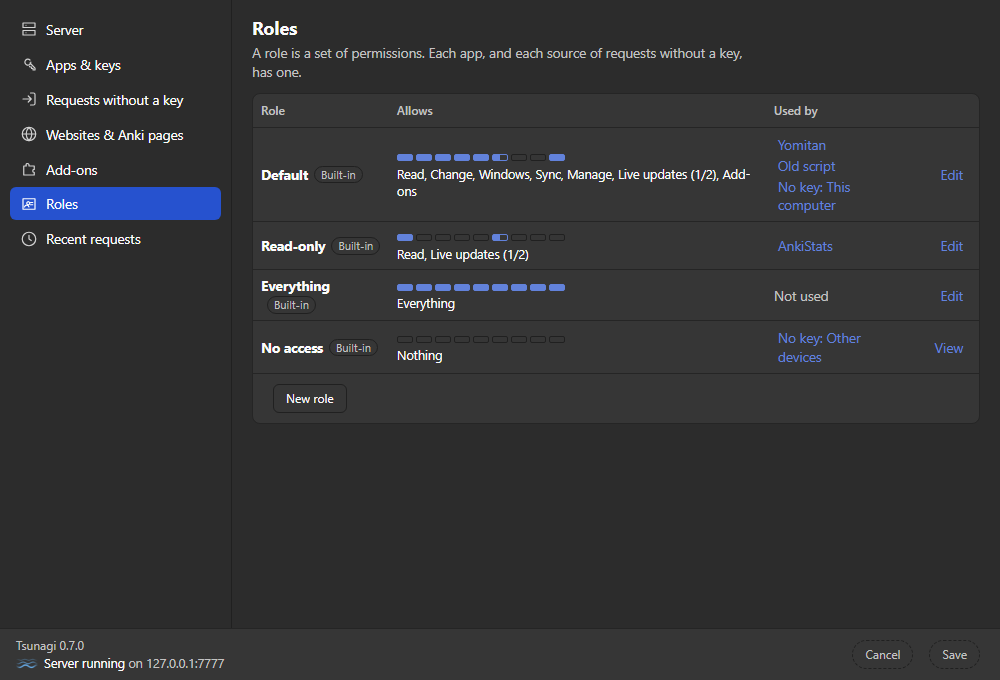
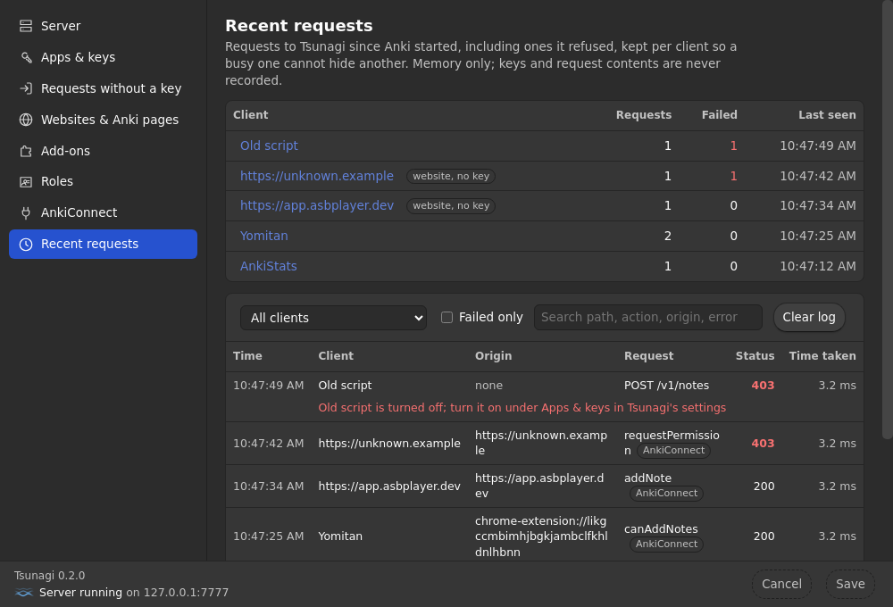

# Tsunagi settings

Open **Tools → Tsunagi Settings** (or the add-on's **Config** button). The
settings page runs inside Anki and talks to Tsunagi directly, never through
the API, so no app, website or card template can read or change it.

Each section below is one page of the settings window, with the setting's
key in the add-on's saved configuration for reference.

- **Save** applies your changes and keeps the window open. Changes to the
  server (on/off, port, host, log level, timeout) restart it right away.
- **Cancel** discards unsaved changes on every page.
- Closing the window with unsaved changes asks first. Each page can also undo
  its own changes or restore its defaults.

## Server



| Setting | Key | Default | |
| --- | --- | --- | --- |
| Run the Tsunagi server | `enabled` | on | |
| Port | `port`, `prefer_port` | 7777 | If the port is busy, Tsunagi says so and doesn't start. It never picks another port. The page sets both keys; a nonzero `port` wins. |
| Host | `host` | `127.0.0.1` | This computer only. Any other address lets other devices connect; they need a key. |
| Other host names | `allowed_hosts` | none | Names this computer is reached by through a proxy on it, such as Tailscale Serve. Bare names: no `http://`, no port. |
| Log level | `log_level` | `warning` | |
| Operation timeout | `op_timeout_seconds` | 15 s | How long a request waits for a busy Anki before answering 503. |
| Max upload size | `media_max_bytes` | 64 MiB | For each media file, however it's sent. |
| Download timeout | `media_fetch_timeout_seconds` | 30 s | For media downloaded from a URL. |

<details>
<summary>More about the server settings</summary>

- **Host names.** A request must be addressed to `localhost`, a loopback
  address, the configured host, a name under **Other host names**, or (with a
  network host) a plain IP address. Anything else gets 403. This stops DNS
  rebinding, where a website's domain points at your computer.
- **Other devices can't connect?** The firewall is the usual cause. On Windows,
  mark your home network as **Private** (Settings → Network & internet → your
  network → Network profile type).
- **Proxies.** A request forwarded by a proxy (it carries
  `Tailscale-User-Login`, `Forwarded`, `X-Forwarded-For`, `X-Forwarded-Host`
  or `X-Real-IP`) never counts as this computer, so without a key it gets the
  role for other devices.
- **Timeouts.** Every 503 says why in `reason`: `busy`, `syncing` or `closed`
  (no profile open); `GET /v1/health` reports the same as `collection.state`.
  A timeout doesn't cancel the work: a write can still finish after the 503.
  Send an `Idempotency-Key` with a write so a retry is safe
  ([Creating notes](https://github.com/mcgrizzz/Tsunagi/blob/main/docs/creating_notes.md)).
  A sync that takes longer answers 202 with a job to poll instead.
- **Idle connections.** The server closes a connection after 75 seconds
  without a request. A client that keeps connections open should close them
  sooner, or retry a request that fails because the connection was closed.
- **Logs** go to Anki's log folder for this add-on, `logs/addons/` in Anki's
  data folder (for example `%APPDATA%\Anki2\logs\addons\` on Windows). They
  rotate daily and are kept for ten days. Attach them to a bug report.

</details>

### AnkiConnect

When AnkiConnect is installed, the Server page shows whether it's on, with
**Take over from AnkiConnect…** until Tsunagi has taken over. The first time
Tsunagi starts with AnkiConnect installed, the settings window opens with the
same offer. It lists what will change; **Take over** then copies AnkiConnect's
port, key and allowed websites, turns AnkiConnect off and restarts Tsunagi on
that port, so your tools keep working unchanged.

- AnkiConnect's key becomes the app **AnkiConnect key**. An empty key doesn't
  replace one you have.
- Websites are added to yours; none are removed.
- If the port is still taken, nothing changes and AnkiConnect keeps running.
- If Tsunagi can't turn this AnkiConnect version off itself, it says so:
  disable AnkiConnect in **Tools → Add-ons**, restart Anki, then take over.
- The button waits until other changes on the page are saved or discarded.

## Apps & keys



Give each tool its own key and role. **Add app** creates a random key and
copies it; **New key** replaces one; untick **On** to turn an app off without
losing its key or role.

A tool sends its key:

- as the `X-Api-Key` header, or `Authorization: Bearer <key>`;
- as `"key"` in AnkiConnect requests;
- as `?api_key=<key>` on `/v1/events` only (browsers can't send headers there).

Saved as `apps`:

```json
"apps": [{"name": "Yomitan", "key": "…", "role": "default"},
         {"name": "Old script", "key": "…", "role": "default", "enabled": false}]
```

- A turned-off app's requests are refused with 403, saying it's turned off.
  That stops its key working, not the program: without the key, it counts as
  any request without a key. To stop a program connecting at all, also set
  **Requests without a key → Programs on this computer** to **No access**.
- A key that matches no app counts as no key, as in AnkiConnect. To check a
  key, send it to `GET /v1/health`: `caller.key` is `valid` or `unknown`.

## Requests without a key



| From | Key | Default role |
| --- | --- | --- |
| Programs on this computer | `no_key_local_role` | Default (everything AnkiConnect allows) |
| Other devices | `no_key_remote_role` | No access |

- **This computer** means the connection comes from this computer and is
  addressed to `127.0.0.1`, `localhost` or `[::1]`, with no proxy in between.
- Set this computer to **No access** to make every tool use a key.
- Anything other than **No access** for other devices lets anyone who can
  reach the port in without a key; the page asks you to confirm.
- A request without a key whose role is No access gets 401 (AnkiConnect:
  `"valid api key must be provided"`).

## Websites & Anki pages



**Allowed website origins** (`cors_allowlist`) decides which web pages may
call Tsunagi from a browser. Tools outside a browser aren't affected.

- The default `http://localhost` works as in AnkiConnect: it also allows
  `127.0.0.1` pages and **every browser extension**, which is why Yomitan
  works with no setup. Remove it to list extensions one by one.
- Add a site as `https://app.asbplayer.dev` (with any port); `*` allows everything.
- Clicking **Yes** on an AnkiConnect permission request adds the site here.
  Remove it to take access away.

**Allow card templates and add-on pages** (`gates.anki_page_scripts`, off)
lets JavaScript inside Anki's own pages (your cards in the reviewer, other
add-ons' pages) use the API. It's off because a shared deck's card template
could otherwise read and change your collection while you study. These pages
can't ask for access; this switch is the only way.

## Add-ons



Actions other add-ons offer to apps
([Add-on providers](https://github.com/mcgrizzz/Tsunagi/blob/main/docs/addon_providers.md)).
An action runs only if it's enabled here **and** the app is allowed to run
it (see Roles).

- Reading an add-on's data doesn't need enabling.
- Enabled actions you can undo join the Default role. Destructive ones (can't
  be undone) join only Everything.
- A destructive action marked **Backs up first** makes an Anki backup before
  each run; the add-on decides which of its actions need one.
- If an add-on update changes whether an action can be undone, it's disabled
  until you enable it again.

Saved as `addon_enabled`:

```json
"addon_enabled": {"my_addon/do_thing": "undoable", "my_addon/clear_history": "destructive"}
```

## Roles



A role is what an app may do. Four are built in; you can edit them (and reset
them) or make your own.

| Role | Allows |
| --- | --- |
| Default | Everything AnkiConnect allows: reading and changing the collection, Anki's windows, sync, import/export and profiles, change events, enabled add-on actions |
| Read-only | Reading, and change events |
| Everything | All of it, including local files, FSRS memory state, review events and destructive add-on actions |
| No access | Nothing |

A request its role doesn't allow gets 403 naming the app, the role and what's
missing. Changes apply at once; an app's open event stream closes (reason
`auth`) so it reconnects with its new permissions.

<details>
<summary>Every permission</summary>

A role grants whole areas or single permissions in them. Each route in the
API reference shows the one it needs (`x-permission`).

| Area | Single permissions | Covers |
| --- | --- | --- |
| `read` | `read:notes`, `read:cards`, `read:decks`, `read:deck_configs`, `read:models`, `read:tags`, `read:reviews`, `read:media`, `read:collection`, `read:addons` | Reading, FSRS computations, jobs, capabilities, the event stream |
| `write` | `write:notes`, `write:cards`, `write:decks`, `write:deck_configs`, `write:models`, `write:tags`, `write:reviews`, `write:media` | Adding, changing, deleting. Undo needs all of `write` |
| `gui` | | Opening and driving Anki's windows |
| `sync` | | Syncing with AnkiWeb. 400: no sync account; 409: Anki needs a full sync (click Sync in Anki once) or another job is running; 502: AnkiWeb unreachable |
| `manage` | | Import, export, check database, switch profile, close Anki |
| `events` | `events:changes`, `events:reviews` | Change messages, and card-answer messages |
| `local_files` | | Media uploads that name a file on this computer. Lets an app read any file you can |
| `memory_state` | | Overwriting cards' FSRS memory state |
| `addon` | `addon:<provider>/<action>` | Running enabled add-on actions |

Saved as `roles`, only for roles you made or edited:

```json
"roles": {"tagger": {"name": "Tagger", "grants": ["read", "write:tags"]}}
```

An app whose role doesn't exist gets nothing.

</details>

## Recent requests



Requests since Anki started, including refused ones, so you can see which tool
is calling and why something failed.

- Grouped by client: an app by name, otherwise the website, otherwise this
  computer or other devices. Click a client to see only its requests.
- Each client keeps its last 50 requests and running totals.
- Filter by client, failures only, or text. **Clear log** empties it.
- Kept in memory only. Never reachable through the API, and never records
  keys or request contents.

## Settings without a field

Edit these by hand: close Anki, open the add-on's folder (**Tools → Add-ons**,
select Tsunagi, **View Files**) and change the `config` section of `meta.json`.

- `ankiconnect_ignore_origins` (default none): websites whose AnkiConnect
  permission requests are refused without asking. Choosing **No** with
  **Ignore further requests** adds one. Remove it to let the site ask again.
- `dev_watch_seconds` (default 0): for working on Tsunagi itself. Reloads the
  server when the add-on's files change, every this many seconds.
- `ankiconnect_import_offered`, `ankiconnect_imported_at`, `config_version`:
  bookkeeping; don't edit. Set `ankiconnect_import_offered` to `false` to be
  asked again, at the next start, whether to take over from AnkiConnect.
