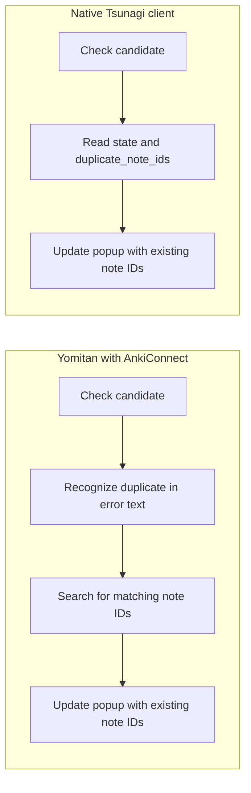

# Yomitan's Anki workflow, with Tsunagi

[← Documentation](README.md) · [Install Tsunagi](../README.md#install)

You look up **食べる** in Yomitan. Before you click anything, the popup needs to
know whether it's already in Anki. If it is, the popup needs the existing note's
ID. If you save a new note, it may also need the generated card IDs.

Let's follow that data from Anki to the interface, starting with the note type
you chose in settings.

The AnkiConnect side below follows Yomitan's source at
[`d34832d`](https://github.com/yomidevs/yomitan/tree/d34832d756e05dc00945e5b7d7ebc80963299a7a).
The native side shows how a client could implement the same workflow with
Tsunagi. **Yomitan itself still uses AnkiConnect requests**; it can already send
those to Tsunagi's compatibility API. This guide doesn't install a native Yomitan integration.

| What the interface needs | Yomitan's AnkiConnect workflow | With native Tsunagi |
| --- | --- | --- |
| Note types and their field names | Load names, then load fields when a type is selected | Load each type with its field names |
| Duplicate status and existing note IDs | Check candidates, recognize duplicates in error text, then search for IDs | Read `state` and `duplicate_note_ids` from the check response |
| New card IDs, when automatic suspension is enabled | Add the note, find its cards, then suspend them | Add the note, then suspend the returned cards |

## Try these examples

Open the [interactive reference](http://127.0.0.1:7777/) while Anki is running.
Use your configured port if different. Select the method/path below and use
**Test Request** to enter the query parameters or JSON body.

For the examples, imagine Yomitan is configured with the **Basic** note type:
**Front** gets the word, **Back** gets its meaning, and notes go into **Default**.
Substitute your actual deck and field names. Response snippets show the relevant
fields only; your IDs will differ.

> [!IMPORTANT]
> The save example adds a note to your open collection. Use a disposable profile
> for experiments. If you configured an API key, supply it in the reference's
> authentication controls.

## 1. You choose a note type in Yomitan settings

**What Yomitan does.** Its settings controller fetches deck names and model names
in parallel. When a note type is selected, it requests that type's field names to
build the field-mapping controls. See the [settings controller](https://github.com/yomidevs/yomitan/blob/d34832d756e05dc00945e5b7d7ebc80963299a7a/ext/js/pages/settings/anki-controller.js#L439-L484)
and [field selection](https://github.com/yomidevs/yomitan/blob/d34832d756e05dc00945e5b7d7ebc80963299a7a/ext/js/pages/settings/anki-controller.js#L1100-L1170).

The [AnkiConnect wrapper](https://github.com/yomidevs/yomitan/blob/d34832d756e05dc00945e5b7d7ebc80963299a7a/ext/js/comm/anki-connect.js#L208-L234)
sends actions to `POST /`. The note-type picker works in two stages:

| When | Action | Response data |
| --- | --- | --- |
| Settings load | `modelNames` | `["Basic", "Cloze", …]` |
| You select Basic | `modelFieldNames` with `modelName: "Basic"` | `["Front", "Back"]` |

Deck names come from a separate `deckNames` action, loaded alongside the model
names. Connection/version checks are omitted from the flows in this guide.

**With native Tsunagi.** Fetch deck names with **`GET /v1/decks`** and note types
with **`GET /v1/models`**:

| Request | Query parameters |
| --- | --- |
| `GET /v1/decks` | `select=id,name` and `limit=10` |
| `GET /v1/models` | `select=id,name,fields[].name` and `limit=10` |

The model query returns entries like:

```json
{
  "items": [
    {"id": 1789162609922, "name": "Basic", "fields": ["Front", "Back"]}
  ]
}
```

The picker can now build Basic's field-mapping controls directly from
`item.fields`. Switch to another model on the loaded page and its fields are
already there too. `select` asks only for the ID, name and field names; templates
and styling aren't needed for this control.

Decks remain a separate query. Follow `next_cursor` when there are more pages;
`limit=10` is a page size, not a limit on the collection's note types.

## 2. You look up a word that's already in Anki

**The popup needs two answers:** is this candidate a duplicate, and which saved
note does it match? A yes/no check alone can't supply the ID needed to open an
existing note.

**With AnkiConnect**, Yomitan first calls `canAddNotesWithErrorDetail`. Its
[duplicate detection](https://github.com/yomidevs/yomitan/blob/d34832d756e05dc00945e5b7d7ebc80963299a7a/ext/js/background/backend.js#L651-L659)
recognizes duplicates by checking the returned error text.

For our example, the AnkiConnect check looks like this:

```json
{
  "action": "canAddNotesWithErrorDetail",
  "version": 6,
  "params": {
    "notes": [{
      "modelName": "Basic",
      "deckName": "Default",
      "fields": {"Front": "食べる", "Back": "to eat"},
      "options": {"allowDuplicate": false, "duplicateScope": "collection"}
    }]
  }
}
```

For a duplicate, that response looks like:

```json
{
  "result": [{
    "canAdd": false,
    "error": "cannot create note because it is a duplicate"
  }],
  "error": null
}
```

There is no note ID in this result. Yomitan then
[finds IDs for the duplicate candidates](https://github.com/yomidevs/yomitan/blob/d34832d756e05dc00945e5b7d7ebc80963299a7a/ext/js/background/backend.js#L705-L753).
Its [lookup helper](https://github.com/yomidevs/yomitan/blob/d34832d756e05dc00945e5b7d7ebc80963299a7a/ext/js/comm/anki-connect.js#L308-L364)
builds Anki search queries and uses `findNotes` through `multi`. It already
deduplicates queries and narrows searches for a batch of candidates.

**With native Tsunagi**, send the candidate to **`POST /v1/notes:check`**:

```json
{
  "notes": [{
    "modelName": "Basic",
    "deckName": "Default",
    "fields": {"Front": "食べる", "Back": "to eat"},
    "allowDuplicate": false,
    "duplicateScope": "collection"
  }]
}
```

The response contains both answers:

```json
{
  "results": [{
    "index": 0,
    "can_add": false,
    "state": "duplicate",
    "duplicate_note_ids": [1789162609990]
  }]
}
```

| From this response | The popup has what it needs to… |
| --- | --- |
| `state: "duplicate"` | Recognize the duplicate without matching an error message |
| `duplicate_note_ids: [1789162609990]` | Offer to open the saved note without searching for its ID |
| `can_add: false` | Respect the requested `allowDuplicate: false` policy |

The request flow for this case becomes:



For several dictionary entries, put their candidates in the same `notes` array.
Each result's `index` identifies its input candidate, with duplicate IDs attached
to that result. Both APIs accept batches for the initial check; the difference
here is that the native response also supplies the IDs.

If the candidate can be added, `can_add` is `true`; for a new word, `state` is
`"normal"` and `duplicate_note_ids` is empty. Other states can describe invalid
fields or a missing note type. Keep those separate from duplicates when deciding
what to show. The check doesn't add anything or reserve a note.

This response covers duplicate status and IDs. Yomitan can also request note and
card details through `notesInfo` followed by `cardsInfo`; a native client needing
those details would still fetch them separately.

The example deliberately uses collection-wide duplicate checking. A native port
must also map Yomitan's configured duplicate scope and related options; don't
silently substitute this example's policy for the user's settings.

## 3. You click the add-note button

**What Yomitan does.** The popup passes the prepared note to its backend, which
calls AnkiConnect's `addNote`. The returned note ID is used to update the popup's
existing-note controls. If enabled, Yomitan also requests suspension of the new
cards and a sync. See [the add-note handler](https://github.com/yomidevs/yomitan/blob/d34832d756e05dc00945e5b7d7ebc80963299a7a/ext/js/display/display-anki.js#L924-L961)
and [the backend call](https://github.com/yomidevs/yomitan/blob/d34832d756e05dc00945e5b7d7ebc80963299a7a/ext/js/background/backend.js#L621-L623).

Suppose you've enabled automatic suspension. Yomitan's
[suspension handler](https://github.com/yomidevs/yomitan/blob/d34832d756e05dc00945e5b7d7ebc80963299a7a/ext/js/background/backend.js#L808-L816)
must first find the cards generated from the new note:

| API | Data flow when saving and suspending |
| --- | --- |
| AnkiConnect | `addNote` → note ID → `findCards` → card IDs → `suspend` |
| Native Tsunagi | `POST /v1/notes` → note **and card IDs** → `POST /v1/cards:suspend` |

The text-only AnkiConnect request is:

```json
{
  "action": "addNote",
  "version": 6,
  "params": {
    "note": {
      "modelName": "Basic",
      "deckName": "Default",
      "fields": {"Front": "食べる", "Back": "to eat"},
      "tags": ["yomitan"],
      "options": {"allowDuplicate": false, "duplicateScope": "collection"}
    }
  }
}
```

Its success response contains the ID: `{"result":1789162609990,"error":null}`.

**With native Tsunagi.** Send **`POST /v1/notes`**:

```json
{
  "modelName": "Basic",
  "deckName": "Default",
  "fields": {"Front": "食べる", "Back": "to eat"},
  "tags": ["yomitan"],
  "allowDuplicate": false,
  "duplicateScope": "collection"
}
```

HTTP **201** returns the note in `result`, including:

```json
{
  "result": {
    "id": 1789162609990,
    "cards": [1789162609990],
    "tags": ["yomitan"]
  }
}
```

The popup uses `result.id` for its existing-note controls. The suspension step
can use `result.cards` immediately, without a card-ID lookup. If suspension is
disabled, there's no suspension request to make. Suspension and sync remain separate,
explicit requests, conditional on the user's settings.

To try the duplicate case in step 2, run its check again after saving this note.
Run only one of the two create requests unless you intend to test duplicate rejection.

## What a real native integration still needs

This walkthrough covers the request flow, not a complete Yomitan port. Field
rendering and media handling still need to work, and the client must map Yomitan's
options, errors and update behavior. Native requests don't accept the complete
AnkiConnect note envelope unchanged: notice how duplicate options moved out of
`options` in the examples.

For paginated reads, keep the same query and pass `next_cursor` as `cursor` until
it becomes `null`. Browser clients also need an allowed origin and any configured
API key. Native requests use `X-API-Key` or a Bearer token; AnkiConnect requests
put the key in the JSON body's `key` property.

Use the [interactive reference](playground.md) for full request schemas,
[native discovery](capabilities.md) for supported operations and settings, and
[compatibility notes](ankiconnect_parity.md) for the existing AnkiConnect API.
