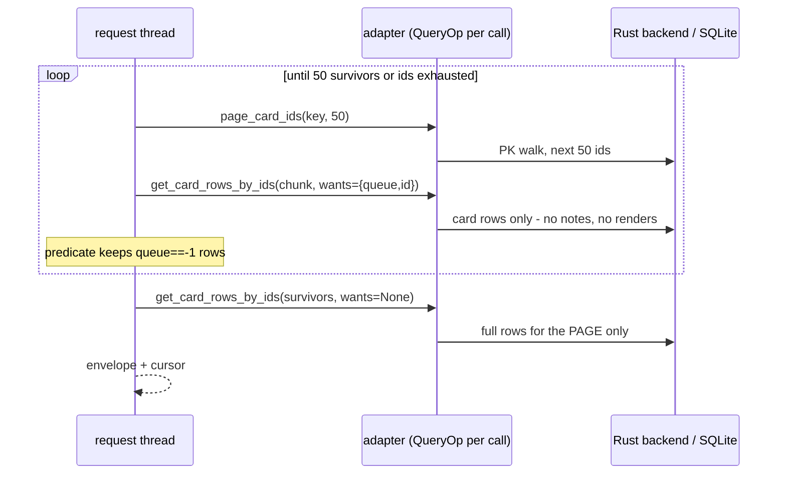

# `GET /v1/cards?where=queue==-1&limit=50` — a two-phase filtered scan

`where` can't be pushed into Anki's search (the DSL filters on OUR row
fields), so a filtered listing must scan — the guarantee is completeness: if
a matching row exists anywhere, it is returned. The question is what each
scanned-and-rejected row costs.

This example asks for 50 results. Omitting `limit` returns all matches.

## Stage by stage

1. **Plan.** No `search`, `queue==-1` matches no index, no `select` → scan
   tier, keyset branch (cards has `page_ids`).

2. **pred_wants.** `_execute_query` computes the fields the predicate
   reads: `{queue, id}`. Because the caller sent no `select` (wants=None,
   "full rows"), the scan switches to **two-phase** mode.

3. **Phase one — cheap scan.** `_keyset_scan` loops:
   `page_card_ids(key, 50)` → hydrate the chunk with `wants={queue, id}` —
   which for cards means *no* note load, *no* renders, *no* scheduling or
   FSRS calls; just the card row's own columns — then run the predicate.
   Chunks keep coming until 50 rows survive or the ids run out.

4. **Phase two — rehydrate the page.** `_rehydrate` re-fetches ONLY the
   surviving rows with `wants=None` (full rows, expensive fields included),
   preserving order. A row deleted between phases just drops out — the same
   read-consistency non-guarantee any cursor pagination has.

5. **Envelope** as usual; the cursor resumes from the last included row.

## The cost shape

With a 1%-selective filter over 150k cards, the old single-phase scan built
full rows — renders, `next_reviews` (2 backend calls), FSRS stats — for
~5,000 scanned cards to emit 50. Two-phase builds cheap rows for the 5,000
and full rows for the 50: the expensive work shrinks by the selectivity
ratio (~100x here). This describes work avoided, not an HTTP latency ratio.

An explicit selection also uses two phases when it needs expensive work that
the predicate does not need. For example:

```text
GET /v1/cards?select=id,question&where=queue==-1&limit=50
```

The first phase reads `id` and `queue`. The second builds `question` for the
matching page. The same rule applies to search-backed ID lists. Cheap
selections such as `id,queue` stay in one pass.

Resources declare groups of fields that share expensive work through
`SourceCaps.expensive_groups`. Cards group note data, rendered HTML, next-review
states and retrievability separately. If a predicate already needs a group's
work, selecting another field from that group does not add a second pass:
filtering on `question` already requires the rendering used by `answer`.
The [measured effect](#measured-effect) is below.



## Measured effect

For `GET /v1/cards?select=id,question&where=queue==-1`, "Before" renders every
scanned card; "Now" renders only the matching ones. Omitting `limit` returns
all matches in both.

| Cards scanned | Matches | Fields selected | Before (ms) | Now (ms) |
| --- | ---: | --- | ---: | ---: |
| 100 | 1 | `id,question` | 7.16 | 1.18 |
| 100 | 1 | `id,queue` | 0.88 | 0.88 |
| 10,000 | 100 | `id,question` | 603.70 | 29.15 |
| 10,000 | 100 | `id,queue` | 23.43 | 23.63 |

`id,queue` is the control: those fields are cheap, so it stays single-phase and
nothing changes. At 10,000 cards the question query now renders 100 cards
instead of 10,000, and results are identical.

Measured on 2026-09-21 with Anki 26.09.2 and Python 3.13.9, in the headless
test harness with no network socket or real Qt dispatch. Both columns run the
same code; "Before" switches off only the resource's `expensive_groups`
declaration, which reproduces the earlier eager behavior. Medians of five
requests after a separate first request, alternating the order each round. This
is a before/after comparison of the Tsunagi API, not an AnkiConnect comparison. To repeat
it, see [performance notes](../performance_notes.md#reproduce-these-measurements).
