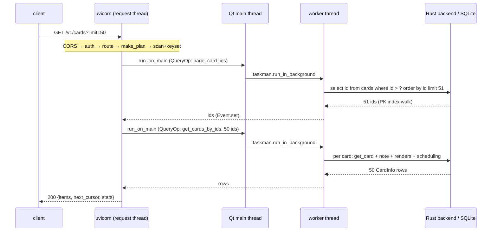

# `GET /v1/cards?limit=50` — a keyset page

The bare listing: no search, no filter, no projection. The planner lands on
the **scan tier with keyset ids** — two Anki round trips total, both
proportional to the page, never to the collection.

## Stage by stage

1. **Socket → handler.** uvicorn (daemon thread) → CORS → auth → the
   factory-generated `_get` handler (`shared/route_factory.py`), running on
   a loop worker thread.

2. **Plan.** `make_plan(select=None, where=None, caps, search=None)`
   (`shared/planning.py`): not search, no indexable clause, no `select`
   for the columns tier, cards has no `fetch_all` (deliberate — full
   materialization is unreachable) → **scan tier**, and cards'
   `SearchSpec.page_ids` is set → the keyset branch.

3. **Ids: one PK walk.** `_keyset_scan` calls
   `page_card_ids(after_id=<cursor>, limit=51)`
   (`adapters/anki/cards.py`) — one `@as_query_op` hop:

   - request thread → `mw.taskman.run_on_main` → Qt main thread builds a
     `QueryOp` → `taskman.run_in_background` → worker thread runs
     `fn(col)` under Anki's collection mutex
   - `col.db.list("select id from cards where id > ? order by id limit ?")`
     → dbproxy → Rust backend → SQLite. `cards.id` is the primary key, so
     this is an index walk: microseconds at any collection size.
   - 51 ids requested for a limit of 50: the extra row is the "is there a
     next page" probe; the cursor is the last returned id.

4. **Hydration: one chunked fetch.** `get_cards_by_ids(ids≤50, wants=None)`
   — a second `@as_query_op` hop. Per card: `col.get_card` (backend row
   read), the note + notetype (for `fields`/`model_name`/`css`), the
   template renders (`question`/`answer`), `next_reviews` (2 backend
   scheduling calls) and `retrievability` (an FSRS stats read). This is the
   expensive part — and it is bounded by the page. Send
   `select=id,due,queue` and `wants` narrows: no note load, no renders, no
   scheduling calls.

5. **Envelope.** `_finish` serializes rows to human field names, attaches
   `next_cursor` and `stats.duration_ms`.

## What this used to cost

Before the keyset work, step 3 was `col.find_cards("")` — the whole-
collection search: 150k ids materialized, coerced, deduped and sorted **per
page request**, then sliced to 50. Measured at ~63ms/page on a mature
collection for the identical wire result; the PK walk is ~1ms. Cursor walks
multiply the difference by the number of pages.

