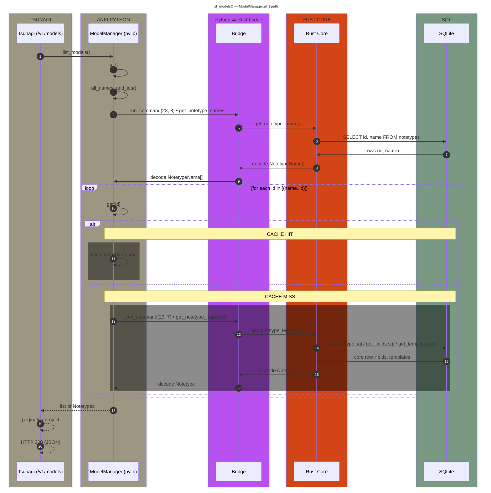

# list_models() — Dataflow

## A) Names & IDs (`service=23, method=8`)

1. **Tsunagi** → `list_models()`

2. **Python** → `anki/pylib/anki/models.py :: ModelManager.all()`

   - **(a)** `ModelManager.all_names_and_ids()`
   - **(b)** **Python backend shim** → `anki/pylib/anki/_generated_backend.py :: get_notetype_names()`
   - **(c)** **Python bridge** → `anki/pylib/anki/_backend.py :: _run_command(23, 8, bytes)`
   - **(d)** **Rust bridge** → `pylib/rsbridge/lib.rs :: Backend::command(23, 8, input)`
   - **(e)** **Rust bridge (dispatcher)** → `Backend::run_service_method(23, 8, input)`
   - **(f)** **Generated dispatcher** → `target/**/build/*/out/backend.rs :: run_backend_notetypes_service_method(8, input)`
   - **(g)** **Generated wrapper** → `Backend::get_notetype_names(self)`
   - **(h)** **Generated wrapper** → `with_col(|col| NotetypesService::get_notetype_names(col))`
   - **(i)** **Rust service** → `rslib/src/notetype/service.rs :: NotetypesService::get_notetype_names(col)`
   - **(j)** **Rust storage** → `rslib/src/storage/notetype/mod.rs :: SqliteStorage::get_all_notetype_names()`
   - **(k)** **SQL** → `rslib/src/storage/notetype/get_notetype_names.sql :: SELECT id, name FROM notetypes`
   - **(l)** **Back to service** → map `(NotetypeId, String)` → `anki_proto::notetypes::NotetypeNames { entries }`
   - **(m)** **Generated wrapper** → encode protobuf `NotetypeNames` → `Vec<u8>` → return to Python
   - **(n)** **Python backend shim** → decode protobuf → `NotetypeNames(entries)` → `ModelManager.all_names_and_ids()` → `[(name, id), …]`

## B) Per-ID materialization used by `all()`

3. **Python** → `anki/pylib/anki/models.py :: ModelManager.get(id)`

   - **(a)** **Cache hit** → return cached `Notetype`
   - **(b)** **Cache miss → legacy fetch:**
     1. **Python backend shim** → `_generated_backend.py :: get_notetype_legacy(id)` (`service=23, method=7`)
     2. **Generated dispatcher** → `run_backend_notetypes_service_method(7, input)`
     3. **Generated wrapper** → `Backend::get_notetype_legacy(self, id)` → `with_col(|col| NotetypesService::get_notetype_legacy(col, id))`
     4. **Rust service/storage fan-out:**
        - `SqliteStorage::get_notetype(id)` (core) → **SQL** `get_notetype.sql`
        - `SqliteStorage::get_notetype_fields(id)` → **SQL** `get_fields.sql`
        - `SqliteStorage::get_notetype_templates(id)` → **SQL** `get_templates.sql`
     5. **Return** → encode protobuf `Notetype` → Python decodes → `ModelManager.get(id)` returns `Notetype`

## C) Assemble & return

4. **Python** → `ModelManager.all()` → list of `Notetype`s (mix of cached and fetched)

5. **Tsunagi** → `list_models()` returns model list

6. **Tsunagi** → paginate / project → **HTTP 200 JSON**

