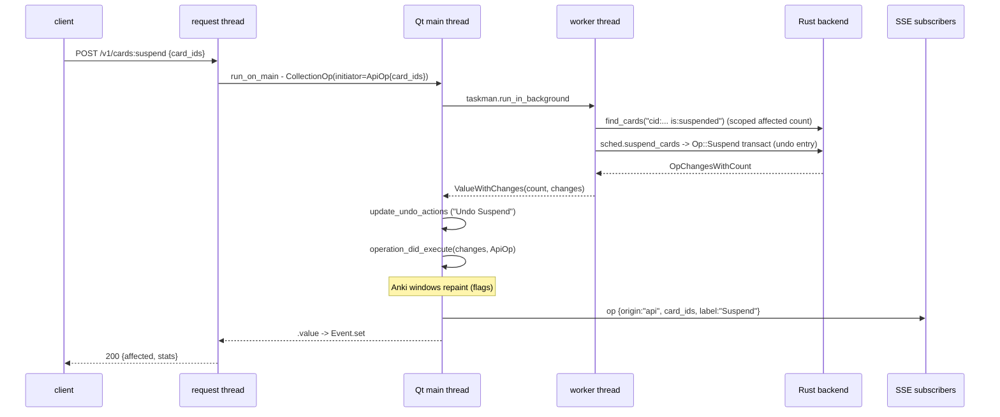

# `POST /v1/cards:suspend` — a mutation's full life

A write touches everything the reads don't: the undo stack, Anki's open
windows, and the event stream. Same request, three audiences.

## Stage by stage

1. **Socket → handler.** CORS → auth → the `_verb`-registered route
   (`http/v1/cards.py`), body validated into `CardIds`.

2. **Adapter wrapper.** `suspend_cards(card_ids)`
   (`adapters/anki/cards.py`) is decorated
   `@as_collection_op(event_details=_ids_details)` — before anything runs,
   the decorator computes `{"card_ids": [...]}` from the arguments. That
   dict rides on the op as its identity.

3. **Cross-thread launch.** `collection_op_call` (`adapters/ops.py`):
   request thread blocks on an Event; Qt main thread builds an aqt
   `CollectionOp` and calls
   `run_in_background(initiator=ApiOp({"card_ids": [...]}))`. The
   `initiator` is delivered VERBATIM to `operation_did_execute` later —
   that is how a change event knows it came from the API and which cards
   were targeted, with no correlation race.

4. **The write.** Worker thread runs the raw verb:
   `col.sched.suspend_cards(ids)` → Rust `Op::Suspend` inside a backend
   transaction — one undo entry — returning `OpChangesWithCount`. The
   adapter wraps it as `ValueWithChanges(count, changes)`: the caller-facing
   affected count plus the REAL change flags. (Before this existed, the op
   reported a fabricated blank `OpChanges` — no browser repaint, no event.)

   The `affected` count itself is one **scoped** search — `cid:a,b,c ...`
   compiles to an indexed `c.id in (...)` — never a whole-collection search.

5. **Fan-out on the main thread.** aqt's `on_op_finished`:
   - `mw.update_undo_actions()` — the Edit menu now shows "Undo Suspend".
   - `operation_did_execute(changes, ApiOp)` fires:
     - **Anki's own windows** (browser, deck list) check the flags and
       repaint — the same signal their own UI actions produce.
     - **Tsunagi's hook** (root `__init__.py`) → `dispatch_op` → the SSE
       broker: subscribers receive
       `change {origin:"api", action:"collection.changed",
       targets:{cards:[...]}, refresh:["cards","decks","notes","reviews","scheduler"],
       anki:{label:"Suspend", changes:["card","study_queues",...]}}`.
       Targets are hints; `refresh` also covers potentially related data.
   - `_success(result)` unwraps `.value` → Event.set → the request thread
     resumes with the affected count.

6. **Response.** `SchedulingResult {affected, stats}`.

## The AnkiConnect shim variant

`POST / {"action": "suspend", "params": {...}}` reaches the SAME adapter:
dispatcher (`http/compat/ankiconnect.py`) → registry → `ac_suspend`
(`http/compat/actions/cards.py`), which first reads the cards' current
state (canonical's semantics: it must answer `false` when there is nothing
to do, and raise for unknown ids), then calls `suspend_cards` for just the
cards that change. Everything below the adapter — threading, undo, events,
repaint — is identical; only the wire shape differs (`true`/`false` in a
`{result, error}` envelope instead of an affected count).

`POST /v1/cards:batch` is this same machinery in a loop with one twist: a
custom undo anchor (`add_custom_undo_entry("Card Batch")`) and a
`merge_undo_entries` after every step, so N verbs collapse into ONE undo
entry and ONE op event carrying the union of the card ids.

